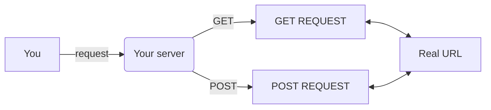

# Let's build little web proxy


## A savoir
`response.body` accepte du `Uint8Array` et non du `arrayBuffer`, il faut donc pas oublier de le convertir

## Final code 
==- Spoiler 
```ts
import { serve, Response } from "https://deno.land/std@0.104.0/http/server.ts";
const server = serve({ port: 11555 });


async function main(request:any){
    let response:Response = {}

    if(request.url.startsWith("/?w=")){
        let link = request.url.split("?w=")[1]
        if(request.method == "GET"){
            let req = await fetch(link, {
                method: "GET",
                headers: {
                    "Content-Type": request.headers.get("Content-Type"),
                    "Accept": request.headers.get("Accept")
                }
            })
            response.body = await req.arrayBuffer()
        } else if(request.method == "POST"){
            let req = await fetch(link, {
                method: "POST",
                headers: {
                    "Content-Type": request.headers.get("Content-Type"),
                    "Accept": request.headers.get("Accept")
                },
                body: request.body
            })
            response.body = await req.arrayBuffer()
        }
    } else {
        response.body = "Error"
        response.status = 404
    }

    //convert arraybuffer to Uint8Array
    response.body = new Uint8Array(response.body)

    request.respond(response)
}


for await (const request of server) {
    if(["GET", "POST"].includes(request.method)){
        main(request)
    } else {
        request.respond({ status: 418 })
    }
}
```
==-