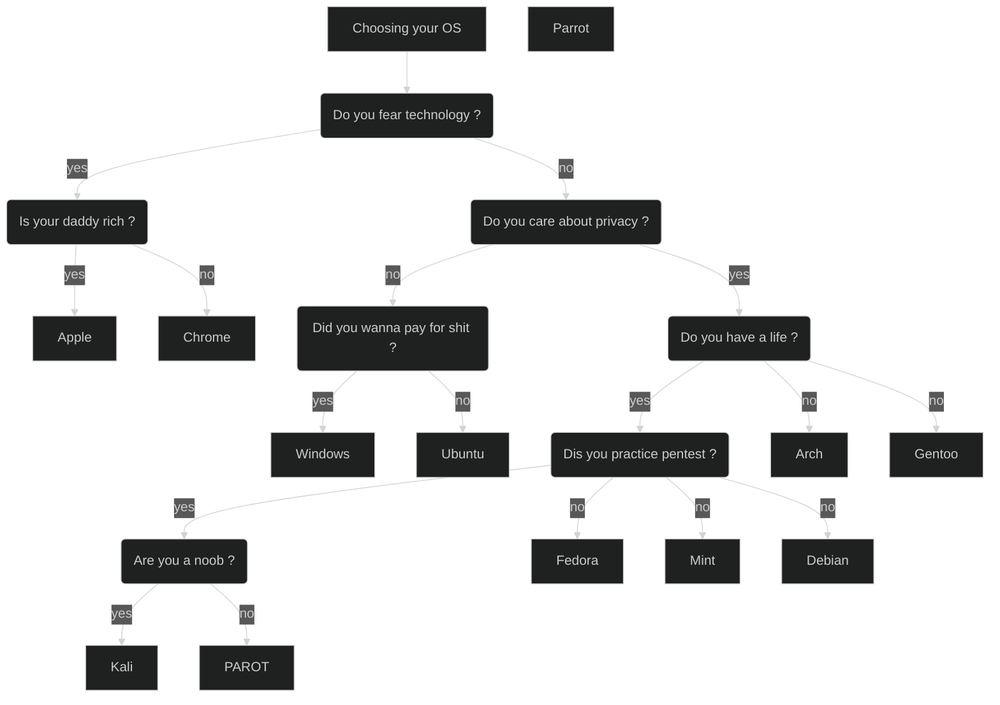

# Choose OS

```mermaid
%%{init: { 'theme': 'dark' } }%%
graph TD

    0[Choosing your OS]

    Q1(Do you fear technology ?)
    
    Q1y1(Is your daddy rich ?)

    Q1n1(Do you care about privacy ?)
    Q1y1n(Did you wanna pay for shit ?)

    Q1y1y(Do you have a life ?)

    QE(Dis you practice pentest ?)
    QE1(Are you a noob ?)


    APPLE[Apple]
    CHROME[Chrome]
    WINDOWS[Windows]
    UBUNTU[Ubuntu]
    ARCH[Arch]
    GENTOO[Gentoo]
    PARROT[Parrot]
    KALI[Kali]
    DEBIAN[Debian]
    FEDORA[Fedora]
    MINT[Mint]


    0 --> Q1;
    Q1 --> |yes|Q1y1;
    Q1 --> |no|Q1n1;
    Q1n1 --> |no|Q1y1n;
    Q1n1 --> |yes|Q1y1y;

    Q1y1y -->|yes|QE;
    QE -->|yes|QE1;


    Q1y1 -->|yes|APPLE;
    Q1y1 -->|no|CHROME;

    Q1y1n -->|yes|WINDOWS;
    Q1y1n -->|no|UBUNTU;

    Q1y1y -->|no|ARCH;
    Q1y1y -->|no|GENTOO;

    QE -->|no|FEDORA;
    QE -->|no|MINT;
    QE -->|no|DEBIAN;

    QE1 -->|yes|KALI;
    QE1 -->|no|PAROT;


```